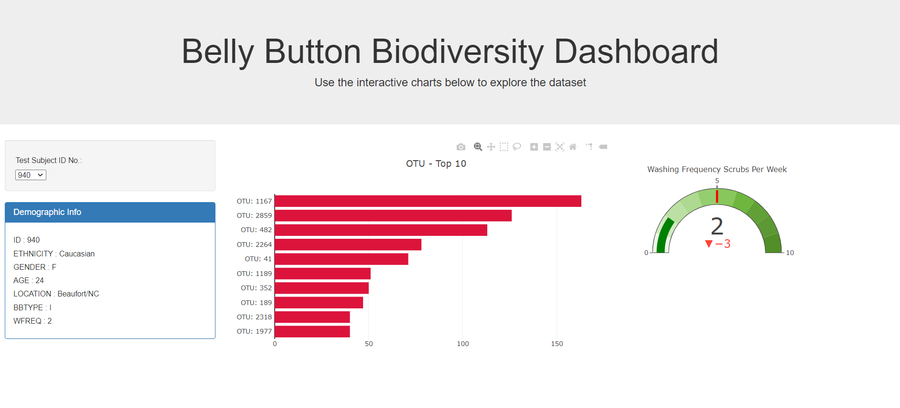

# 14_Belly_Button_Diversity_JavaScript 

  

In this assignment, Latyr is creating a dashboard displaying several charts. The dashboard must allow users to select and filter data by Subject ID (No.).

## Data Source(s)
The data is coming from a JSON file.
## Methods
* Used HTML, JavaScript and HTML

## Website or Links
https://latyrt.github.io/15_JavaScript_D3/index.html

## Results

